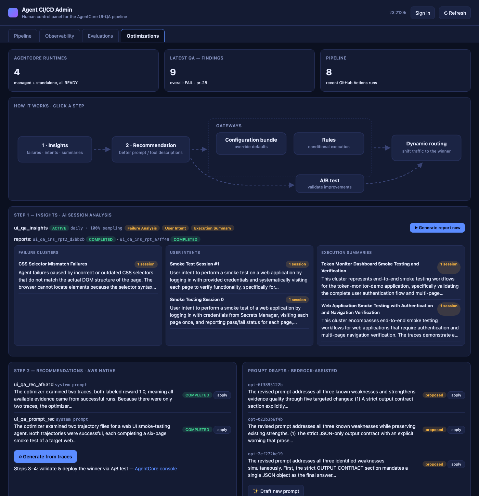
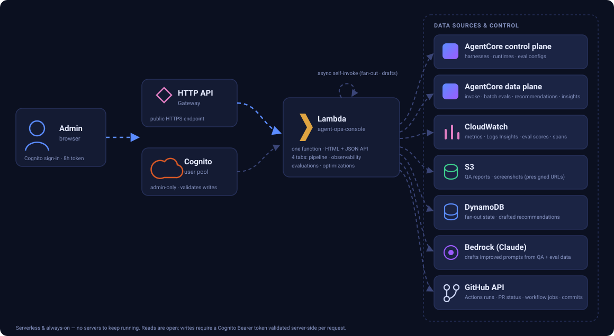
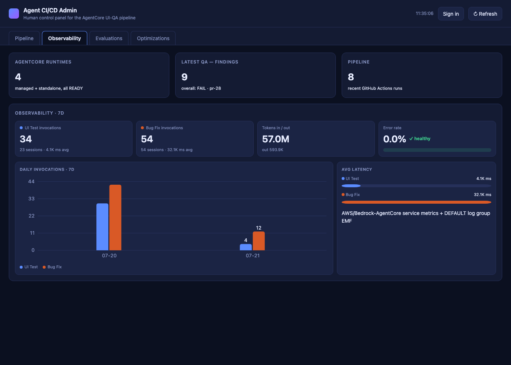
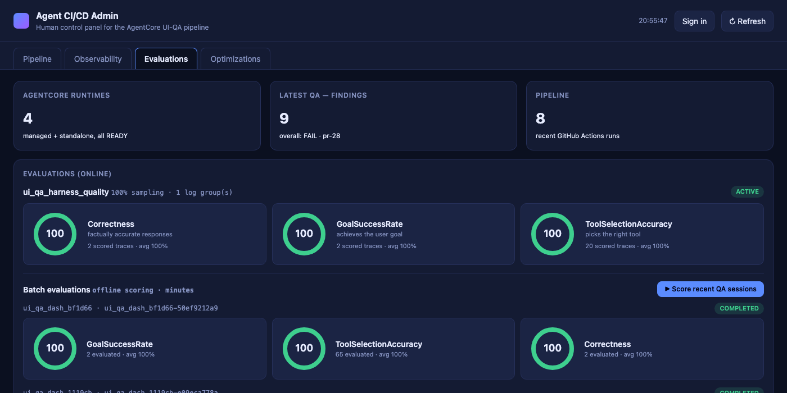

# Agent CI/CD Admin Dashboard

A serverless, always-on **human control panel for Amazon Bedrock AgentCore agents running in CI/CD** —
monitor them, score them, analyze their failures, and optimize their prompts, all from one page.

Built for the pattern where AgentCore harnesses do autonomous UI-QA and bug-fixing inside GitHub
Actions ([companion best-practices repo](https://github.com/timwukp/Harness-agentic-AI-agent-best-practices-and-use-case)),
but the dashboard works with any AgentCore harness/runtime setup.



## What you get — four tabs

| Tab | What it shows | Backed by |
|---|---|---|
| **Pipeline** | Harness/runtime status, GitHub Actions runs & PRs, latest QA findings with severity + evidence, QA screenshots, concurrent QA fan-out (1–10 parallel sessions) | AgentCore control plane, GitHub API, S3 |
| **Observability** | Per-harness invocations / sessions / latency / error-rate stat tiles, 7-day daily-invocations column chart, token usage | `AWS/Bedrock-AgentCore` CloudWatch metrics + EMF `gen_ai.client.token.usage` |
| **Evaluations** | Online evaluation score gauges (Builtin.Correctness / GoalSuccessRate / ToolSelectionAccuracy), one-click **batch evaluation** of recent QA sessions (offline scoring in minutes) | AgentCore Evaluations (online configs + data-plane `StartBatchEvaluation`) |
| **Optimizations** | Animated clickable how-it-works flow, **AI Insights** (failure root-cause clusters, user intents, execution summaries — on-demand reports), **AWS-native prompt recommendations** (`StartRecommendation`) and Bedrock-drafted alternatives, one-click apply via `UpdateHarness` | AgentCore Optimizations (data-plane SDK) + Bedrock |

Write actions (fan-out, apply, generate) are protected by **Cognito login** (8-hour access tokens,
server-side validation via `cognito-idp:GetUser`). Read-only views need no sign-in.

## Architecture



Single Lambda, no build step, no framework — the dashboard HTML/JS/SVG lives inside
`src/lambda_function.py` and is served on `GET /`. HTTP API Gateway is used instead of a Lambda
Function URL because some org guardrails block public Function URLs.

Data sources read by the Lambda: AgentCore control & data planes, CloudWatch (metrics, Logs
Insights, eval scores, spans), S3 (QA reports & screenshots), DynamoDB, Bedrock, and the **GitHub
REST API** (Actions workflow runs, open PRs, workflow jobs/steps, and branch commits — anonymous by
default, `GITHUB_TOKEN` optional to lift rate limits).

## Deploy

```bash
export UI_HARNESS=MyUiTestHarness-AbC123        # required: harness to monitor/optimize
export BUGFIX_HARNESS=MyBugFixHarness-XyZ789    # optional second harness
export TARGET_REPO=org/repo                     # CI repo shown in the Pipeline tab
export TARGET_URL=https://your-app.example.com  # site under test
export QA_BUCKET=your-qa-reports-bucket         # where QA reports land
export LOGIN_SECRET_ID=your-app/login-creds     # test-site creds for fan-out sessions
export SKILL_REPO_URL=https://github.com/org/skill-repo
./deploy/deploy.sh
```

The script creates (idempotently): DynamoDB table, IAM role, Cognito user pool + `admin` user
(password goes to Secrets Manager `agent-admin/dashboard-login`, never printed), the Lambda, and an
HTTP API Gateway. Re-run it to ship code updates.

## CRITICAL prerequisite: enable trace sampling

AgentCore harness runtimes default to `trace_sampled=False`. **Evaluations, batch scoring, insights,
and recommendations all read OTel span documents — with sampling off they silently produce nothing**
(online evals sit ACTIVE forever with zero scores; batch evals fail with "All N sessions failed").

```python
ctl.update_harness(harnessId=HID,
    environmentVariables={"OTEL_TRACES_SAMPLER": "always_on"},
    clientToken=secrets.token_hex(20))
```

Then set `SPANS_SINCE` (ISO timestamp of when you enabled it) so the dashboard excludes older,
unscoreable sessions from batch runs. Also confirm CloudWatch Transaction Search is enabled
(`aws xray get-trace-segment-destination` → `CloudWatchLogs/ACTIVE`).

## Hard-won field notes

This dashboard was built against the AgentCore **preview** APIs; the gotchas are documented as
reference files in the companion skill
([agent-skills-best-practice → agentcore-harness-builder](https://github.com/timwukp/agent-skills-best-practice/tree/main/skills/skills/agentcore-harness-builder/references)),
including: batch evaluation / recommendations / insights all live on the **data-plane** SDK client
(not control-plane); `StartBatchEvaluation` FAS caller permissions; evaluation-config name regex and
clientToken length; insight results returned as typed structures on `GetBatchEvaluation`; A/B test
anatomy (requires a Gateway front).

## Screenshots

| | |
|---|---|
|  |  |

## Roadmap

- **Native A/B testing** via Gateway: front the harness with an AgentCore Gateway, register
  control/variant runtimes as two `agentcoreRuntime` targets, `CreateABTest` with weighted split and
  per-variant online evaluation configs → statistical results (p-value, confidence intervals).
- Insights scheduled-report browser (daily reports already generate server-side).

## Author

**Tim WU** ([@timwukp](https://github.com/timwukp))

## Disclaimer

This is a personal open-source project, provided **"as is" without warranty of any kind** (see
[LICENSE](LICENSE)). It is **not an official AWS product** and is not affiliated with, endorsed by, or
supported by Amazon Web Services. It builds against Amazon Bedrock AgentCore **preview** APIs, which may
change without notice and break this project at any time. You are responsible for the AWS costs, security
posture (IAM permissions, Cognito configuration, exposed endpoints), and compliance of anything you deploy
from this repository — review the IAM policy and deployment scripts before running them in your account.

## License

[MIT](LICENSE)
